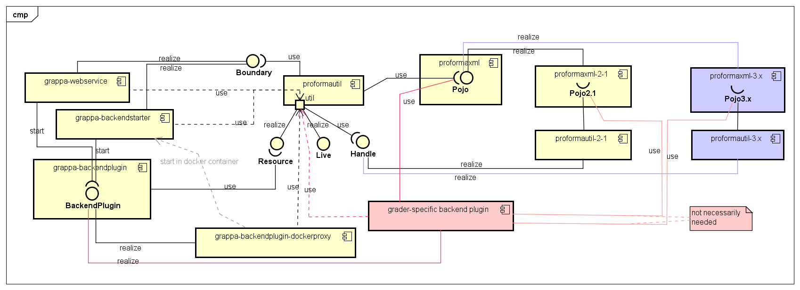
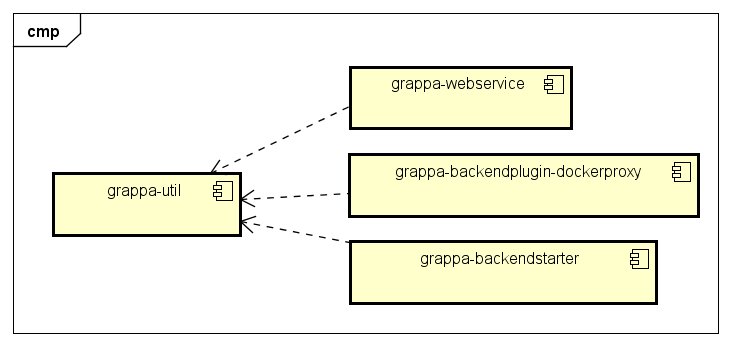

# Grappa Web service 

## Table of Contents
1 [Introduction](#1-introduction)<br>
2 [Installation](#2-installation)<br>
&nbsp;&nbsp;&nbsp;&nbsp;2.1 [System Requirements](#21-system-requirements)<br>
&nbsp;&nbsp;&nbsp;&nbsp;2.2 [Prerequisites](#22-prerequisites)<br>
&nbsp;&nbsp;&nbsp;&nbsp;&nbsp;&nbsp;&nbsp;&nbsp;[2.2.1 Installing Redis](#221-installing-redis)<br>
&nbsp;&nbsp;&nbsp;&nbsp;&nbsp;&nbsp;&nbsp;&nbsp;[2.2.2 Installing Docker](#222-installing-docker)<br>
&nbsp;&nbsp;&nbsp;&nbsp;2.3 [Building and Deployment](#23-building-and-deployment)<br>
&nbsp;&nbsp;&nbsp;&nbsp;2.4 [Configuration](#24-configuration)<br>
3 [REST API](#3-rest-api)<br>
&nbsp;&nbsp;&nbsp;&nbsp;[Get web service status](#get-web-service-status)<br>
&nbsp;&nbsp;&nbsp;&nbsp;[Grade a Proforma submission](#grade-a-proforma-submission)<br>
&nbsp;&nbsp;&nbsp;&nbsp;[Poll for a Proforma response](#poll-for-a-proforma-response)<br>
&nbsp;&nbsp;&nbsp;&nbsp;[Cancel a Proforma submission](#cancel-a-proforma-submission)<br>
&nbsp;&nbsp;&nbsp;&nbsp;[Get list of all online graders](#get-list-of-all-online-graders)<br>
&nbsp;&nbsp;&nbsp;&nbsp;[Get grader status](#get-grader-status)<br>
&nbsp;&nbsp;&nbsp;&nbsp;[Check if a Proforma task is cached](#check-if-a-proforma-task-is-cached)<br>
4 [Backend Plugin](#4-backend-plugin)<br>
&nbsp;&nbsp;&nbsp;&nbsp;4.1 [proformaxml module](#41-proformaxml-module)<br>
&nbsp;&nbsp;&nbsp;&nbsp;4.2 [grappa-backend-plugin-api module](#42-grappa-backend-plugin-api-module)<br>
&nbsp;&nbsp;&nbsp;&nbsp;4.3 [grappa-backend-plugin-docker-proxy module](#43-grappa-backend-plugin-docker-proxy-module)<br>
5 [Modules](#5-modules)<br>
6 [Understanding the Submission Process](#6-understanding-the-submission-process)<br>
<!--- 5 [Docker](#2-internationalization)<br> -->
<!--- 6 [Vagrant](#2-internationalization)<br> -->
<!--- 7 [Development](#3-elements-and-types-that-are-used-in-several-parts-of-the-xsd)<br> -->
<!-- 8 [Workflow](#6-workflow)<br> -->


## 1 Introduction

A web service for connecting multiple Learn Management Systems to multiple automatic graders with a unified interface.

## 2 Installation

### 2.1 System Requirements

- [JDK 11 or higher](http://www.oracle.com/technetwork/java/javase/downloads/index.html)

  *Note: JDK 11 is used to develop and compile the Grappa web service. Backend Plugin modules use JDK 8 to ensure compatibility with existing graders.*
- [Apache Tomcat 8.X or higher](http://tomcat.apache.org/) for running the web service
- [Apache Maven](https://maven.apache.org/index.html) for building a web application resource
- [Redis](https://redis.io/) for storing ProFormA submissions and results
- [Docker](https://www.docker.com/) for providing an additional security layer to the web service

### 2.2 Prerequisites

Install the software listed in the [System Requirements](21-system-requirements).

#### 2.2.1 Installing Redis

  - Install Redis, e.g. `sudo apt install redis-server`
  - edit file `/etc/redis/redis.conf` 
    - comment out line `bind 127.0.0.1 ::1`
    - add line `bind 0.0.0.0`
    - activate line `requirepass foobared` with a password of your choosing
      - the password must be set in Grappa's [configuration](#24-configuration) file
    - restart redis using `sudo systemctl restart redis`
    - test if everything is properly running by logging into redis' command line interface:
    
        pi@rpi: redis-cli
    
        pi@rpi: auth foobared

#### 2.2.2 Installing Docker

  - Install Docker, e.g. https://docs.docker.com/engine/install/ubuntu/
  - if Grappa and Docker are intended to run on different servers, you may need to expose the Docker API over TCP so a connection can be established remotely
    - edit file `/lib/systemd/system/docker.service`
    - comment out line `ExecStart=/usr/bin/dockerd -H fd:// --containerd=/run/containerd/containerd.sock`
    - add line `ExecStart=/usr/bin/dockerd -H tcp://0.0.0.0:2376 --containerd=/run/containerd/containerd.sock`
    - reload the Docker service
      - `sudo systemctl daemon-reload`
      - `sudo systemctl restart docker`
      - Note that you may need to reboot the entire machine after these changes if remote API calls to Docker cause the following exception: `com.github.dockerjava.api.exception.InternalServerErrorException:
    Status 500: failed to create endpoint <containerName> on network bridge`

### 2.3 Building and Deployment

*Note: deploying and running Grappa has been tested on Ubuntu Linux 18.04 and Windows 10.*

The following building and deployment instructions are for Ubuntu Linux.

1. Download the [Grappa repository](https://github.com/hsh-elc/grappa-webservice) or use git cloning

    git clone https://github.com/hsh-elc/grappa-webservice.git
    
2. Build Docker Images by changing to directory `grappa-webservice/grappa-backend-plugin-docker-proxy/src/main/resources/docker` and then executing the `build-images.sh` script

Note that any changes to the `grappa-webservice/grappa-backend-plugin-docker-proxy/src/main/resources/docker/` directory, specifically its docker, shell and JAR files will require re-executing the `build-images.sh` script to take effect. This includes changes to the `grappa-grader-backend-starter` module, as well as adding and changing grader Backend Plugins.

3. Navigate to Grappa's root directory `grappa-webservice/` and build the web application resource using maven.

    mvn install package -DskipTests
    
*Note: skipping tests is recommended at this point, since running the tests requires the web service to be already deployed and running in Tomcat. Not skipping the tests will not affect the build process in any way, but it will result in additional error messages on part of the maven-test-plugin.* 

4. Copy the resulting WAR file `grappa-webservice/grappa-webservice/target/grappa-webservice-2.M.N.jar`  to Tomcat's webapps directory (`CATALINA_BASE/webapps/grappa-webservice-2.jar`)

5. Configure Grappa

  - copy file `grappa-webservice/grappa-webservice/src/main/resources/grappa-config.yaml.example` to `/etc/grappa/` (or `C:/etc/grappa/` on a Windows-based system) and remove the `.example` part
  -  refer to section [Configuration](#24-configuration) for more details
  
5. Run Tomcat (e.g. `sudo systemctl start tomcat`)

  - you may want to test the web service locally by using a GET request to the [serivce's status endpoint](get-web-service-status) using  `curl` like so: `curl -v --user test:test http://127.0.0.1:8080/grappa-webservice-2/rest`, with `test:test` being the LMS ID and password hash, respectively

6. Set the connection string in your LMS client to `http://serverip:8080/grappa-webservice-2/rest`

### 2.4 Configuration

Any changes to Grappa's configuration file will require a web service restart to take effect.

Grappa's configuration file's location and file name must be `/etc/grappa/grappa-config.yaml`.

An example file can be found in [`grappa-webservice/src/main/resources/grappa-config.yaml.example`](../../grappa-webservice/src/main/resources/grappa-config.yaml.example).

## 3 REST API


### Get web service status

Get the web service's status information, such as runtime infos.
    
* **URL**

  `/`

* **Method**
  
  `GET`
  
* **Required URL Params**
 
  *None*

* **HTTP Responses**
  
  * **Code:** `200 OK` <br/>
    **Content**:
    ```
    {
      "service": {
        "webappName": "grappa-webservice-2.0.0",
        "staticConfigPath": "/etc/grappa/grappa-config.yaml",
        "totalGradingProcessesExecuted": 0,
        "totalGradingProcessesSucceeded": 0,
        "totalGradingProcessesFailed": 0,
        "totalGradingProcessesCancelled": 0,
        "totalGradingProcessesTimedOut": 0,
        "totalAllExceptExecuted": 0,
        "graderRuntimeInfo": [
          {
            "id": "javaGrader-v1.0",
            "name": "Java Grader",
            "poolSize": 10,
            "busyInstances": 0,
            "queuedSubmissions": 0,
            "gradingProcessesExecuted": 0,
            "gradingProcessesSucceeded": 0,
            "gradingProcessesFailed": 0,
            "gradingProcessesCancelled": 0,
            "gradingProcessesTimedOut": 0
          },
          {
            "id": "sqlGrader-v1.42",
            "name": "SQL Grader",
            "poolSize": 10,
            "busyInstances": 0,
            "queuedSubmissions": 0,
            "gradingProcessesExecuted": 0,
            "gradingProcessesSucceeded": 0,
            "gradingProcessesFailed": 0,
            "gradingProcessesCancelled": 0,
            "gradingProcessesTimedOut": 0
          }
        ]
      }
    }
    ```
    **Content Type**: `application/json` <br/>
    **Description**: Returns the status of a grader. This data is subject to change. It is not intended to be processed by a machine, but rather serves an overview for debugging or statistical purposes.
       
  * **Code:** `401 Unauthorized` <br/>
    **Content**: `{ error : "message" }` <br/>
    **Content Type**: `application/json` <br/>
    **Description**: Unauthorized access to this resource.

  * **Code:** `500 Internal Server Error` <br/>
    **Content**: `{ error : "message" }` <br/>
    **Content Type**: `application/json` <br/>
    **Description**: Unexpected server error.

### Grade a Proforma submission

Submit a Proforma submission for grading.

* **URL**

  `/:lmsid/gradeprocesses?graderId=:graderId&async=:async`

* **Method**
  
  `POST`
  
* **Required URL Params**

  * `lmsid=[string]`: The LMS-ID, which represents the client ID.
   
  * `graderId=[string]`: The grader instance to be used for grading a submission.
   
  **Optional URL Params**
   
  * `async=[boolean][default=true]`: `true` if this `POST` request should return immediately after submitting the
   Proforma submission for asynchronous grading, or `false` if the `POST` request should block until a Proforma
    response is returned. Synchronous calls will automatically time out with a `202 Accepted` and an `estimatedSecondsRemaining` after a pre-configured time span is exceeded. A timeout may occur due to a large number of queued submissions, in which case the client can poll for the result at a later time.

  * `prioritize=[boolean][default=false]`: `true`, if the submission should be prioritized and graded as soon as a
   grader instance is available, or `false`, if the submission should join the tail of the submission queue. 

* **HTTP Responses**
  
  * **Code:** `201 Created` <br/>
     **Content**:
    ```
    {
        "gradeProcessId" : "String Id",
        "estimatedSecondsRemaining": "Integer"
    }
    ```
     **Content Type**: `application/json` <br/>
     **Description**: The Proforma submission has been accepted for grading. Use `gradeProcessId` for subsequent polling
      requests. `estimatedSecondsRemaining` indicates the time remaining until the submission is graded.
     
  * **Code:** `400 Bad Request` <br/>
    **Content**: `{ error : "message" }` <br/>
    **Content Type**: `application/json` <br/>
    **Description**: The incoming Proforma submission document was ill-formatted or missing required information.
       
  * **Code:** `401 Unauthorized` <br/>
    **Content**: `{ error : "message" }` <br/>
    **Content Type**: `application/json` <br/>
    **Description**: Unauthorized access to this resource.

  * **Code:** `404 Not Found` <br/>
    **Content**: `{ error : "message" }` <br/>
    **Content Type**: `application/json` <br/>
    **Description**: Parameter `:lmsid` or `:graderId` does not exist.

  * **Code:** `500 Internal Server Error` <br/>
    **Content**: `{ error : "message" }` <br/>
    **Content Type**: `application/json` <br/>
    **Description**: Unexpected server error.  
  
### Poll for a Proforma response

Poll for the status of a Proforma submission (queued for grading, being graded, or already finished).   
    
* **URL**

  `/:lmsid/gradeprocesses/:gradeProcessId`

* **Method**
  
  `GET`
  
* **Required URL Params**
 
  `lmsid=[string]`
   
  `gradeProcessId=[string]`

* **Required Request Headers**

  * `Accept`=`application/xml` or `multipart/form-data` or`application/octet-stream` <br/>
     **<a name="result-spec-note">Note</a>:** The content type for the `Accept` header should be chosen in
      relation to the `format` attribute specified in the [Proforma submission result-spec element](https://github.com/Proforma/proformaxml/blob/master/Whitepaper.md#the-result-spec-element).
      `application/xml` must be used when the client expects a Proforma `response.xml` file and `multipart/form-data` or`application/octet-stream` for a `response.zip` file.
        

* **HTTP Responses**
  
  * **Code:** `200 OK` <br/>
     **Content**: A Proforma Response file named `response.(xml|zip)` <br/>
     **Content Type**: The content depends on the media type of the Proforma response supplied by a grader. In case
      of a Proforma `response.xml` file, Grappa's HTTP response to the client's `GET` request will be of type
       `application/xml`. If the grader supplies a Proforma `response.zip`, the HTTP response to the client will be of type
       `multipart/form-data` or `application/octet-stream`, depending on what the client is able to accept as specified by the `Accept` HTTP header in its request.<br/>
     **Description**: Grading of the submission has finished one way or another. A grading process may either
      finish successfully, be cancelled by a client, or fail for any other technical reason. If the grading process
       finished successfully or failed, a Proforma response for
       the submission will be returned in the HTTP response's content body. Refer to the Proforma response's [is-internal-error flag](https://github.com/Proforma/proformaxml/blob/master/Whitepaper.md#is-internal-error) 
       to determine if the grading process failed. In case the grading process was cancelled by the client, the HTTP
        response's content body will return empty. If the cancellation request is sent in on an already finished
         grading process, the cancellation will have no effect and the response's content body will be a valid Proforma response.   
     
  * **Code:** `202 Accepted` <br/>
    **Content**: `{"estimatedSecondsRemaining": "Integer"}` <br/>
    **Description**: The grading process is either pending or in progress. `estimatedSecondsRemaining` indicates the time remaining until the submission is graded.
       
  * **Code:** `401 Unauthorized` <br/>
    **Content**: `{ error : "message" }` <br/>
    **Content Type**: `application/json` <br/>
    **Description**: Unauthorized access to this resource.

  * **Code:** `404 Not Found` <br/>
    **Content**: `{ error : "message" }` <br/>
    **Content Type**: `application/json` <br/>
    **Description**: Parameter `:lmsid` or `:gradeProcessId` does not exist.
    
  * **Code:** `500 Internal Server Error` <br/>
    **Content**: `{ error : "message" }` <br/>
    **Content Type**: `application/json` <br/>
    **Description**: Unexpected server error.  
   
### Cancel a Proforma submission 

Cancel and delete a Proforma submission that is queued for grading or is currently being graded. This request has no
 effect on an already graded submission.
    
* **URL**

  `/:lmsid/gradeprocesses/:gradeProcessId`

* **Method**
  
  `DELETE`
  
* **Required URL Params**
 
  `lmsid=[string]`
   
  `gradeProcessId=[string]`

* **HTTP Responses**
  
  * **Code:** `200 OK` <br/>
    **Content**: *None* <br/>
     **Description**: The pending submission has been removed from the submission queue, or the grading process has
      been cancelled if the submission was currently being graded. The content body will return empty in either case. <br/>
     
  * **Code:** `401 Unauthorized` <br/>
    **Content**: `{ error : "message" }` <br/>
    **Content Type**: `application/json` <br/>
    **Description**: Unauthorized access to this resource.

  * **Code:** `404 Not Found` <br/>
    **Content**: `{ error : "message" }` <br/>
    **Content Type**: `application/json` <br/>
    **Description**: Parameter `:lmsid` or `:gradeProcessId` does not exist.

  * **Code:** `500 Internal Server Error` <br/>
    **Content**: `{ error : "message" }` <br/>
    **Content Type**: `application/json` <br/>
    **Description**: Unexpected server error.  

### Get list of all online graders 

Get the list of graders that are enabled and ready to take on submissions.
    
* **URL**

  `/graders`

* **Method**
  
  `GET`
  
* **Required URL Params**
 
  *None*

* **HTTP Responses**
  
  * **Code:** `200 OK` <br/>
    **Content**: Example graders:
    ```
    {
        "graders": {
            "graderId1": "human-friendly grader name 1"
            "graderId2": "human-friendly grader name 2"
        }
    }
    ```
    **Content Type**: `application/json` <br/>
    **Description**: Returns a list of graders that are enabled for grading.
       
  * **Code:** `401 Unauthorized` <br/>
    **Content**: `{ error : "message" }` <br/>
    **Content Type**: `application/json` <br/>
    **Description**: Unauthorized access to this resource.

  * **Code:** `500 Internal Server Error` <br/>
    **Content**: `{ error : "message" }` <br/>
    **Content Type**: `application/json` <br/>
    **Description**: Unexpected server error.  

### Get grader status 

Get the status, e.g. grader statistics, of a specific grader.
    
* **URL**

  `/graders/:graderId`

* **Method**
  
  `GET`
  
* **Required URL Params**
 
  `graderId=[string]`

* **HTTP Responses**
  
  * **Code:** `200 OK` <br/>
    **Content**:
    ```
    {
      "id": "sqlGrader",
      "name": "SQL Grader",
      "poolSize": 10,
      "busyInstances": 0,
      "queuedSubmissions": 0,
      "gradingProcessesExecuted": 0,
      "gradingProcessesSucceeded": 0,
      "gradingProcessesFailed": 0,
      "gradingProcessesCancelled": 0,
      "gradingProcessesTimedOut": 0
    }
    ```
    **Content Type**: `application/json` <br/>
    **Description**: Returns the status of a grader. This data is subject to change.    
       
  * **Code:** `401 Unauthorized` <br/>
    **Content**: `{ error : "message" }` <br/>
    **Content Type**: `application/json` <br/>
    **Description**: Unauthorized access to this resource.

  * **Code:** `404 Not Found` <br/>
    **Content**: `{ error : "message" }` <br/>
    **Content Type**: `application/json` <br/>
    **Description**: Parameter `graderId` does not exist.

  * **Code:** `500 Internal Server Error` <br/>
    **Content**: `{ error : "message" }` <br/>
    **Content Type**: `application/json` <br/>
    **Description**: Unexpected server error.

### Check if a Proforma task is cached 

Check if a particular task is cached by the middleware to avoid including the task in Proforma
 submissions when doing repeated grading requests for the same Proforma task.
    
* **URL**

  `/tasks/:taskUuid`

* **Method**
  
  `HEAD`
  
* **Required URL Params**
 
  `taskUuid=[string]`

* **HTTP Responses**
  
  * **Code:** `200 OK` <br/>
    **Content**: *None* <br/>
    **Description**: The specified task is cached by the middleware.
       
  * **Code:** `401 Unauthorized` <br/>
    **Content**: `{ error : "message" }` <br/>
    **Content Type**: `application/json` <br/>
    **Description**: Unauthorized access to this resource.

  * **Code:** `404 Not Found` <br/>
    **Content**: `{ error : "message" }` <br/>
    **Content Type**: `application/json` <br/>
    **Description**: Parameter `taskUuid` does not exist, meaning the task is not cached by the middleware.

  * **Code:** `500 Internal Server Error` <br/>
    **Content**: `{ error : "message" }` <br/>
    **Content Type**: `application/json` <br/>
    **Description**: Unexpected server error.

## 4 Backend Plugin

Grappa passes submissions onto the actual grader backend system. A backend plugin is used to connect a grader to the Grappa webservice. 

### 4.1 proformaxml module

The `proformaxml` module contains the POJO classes for the [ProForma](https://github.com/ProFormA/proformaxml) format (currently version 2.1).

### 4.2 grappa-common module

There are two different ways to pass a submission to a grader system from within a grader backend plugin.

<!--- 
TODO: uml class diagram of proformaxml, plugin-api and an example grader.
-->

Grappa (as well as the [docker-proxy module](#43-grappa-backend-plugin-docker-proxy-module)) passes a Proforma submission as a byte array resource to a backend plugin. This is because a submission resource needs to be in a suitable storage format so it can be transmitted between different parts of the service system (e.g. different parts of the service running on different systems, such as physical servers, Vagrant and Docker environments).

#### Passing a Proforma submission as a blob resource

The backend plugin may pass the submission blob as is to the grader and have the grader deal with the interpretation and implementation of the Proforma format in its own way.

#### Passing a Proforma submission as a Java class object

The backend plugin may convert the submission blob into a Java class instance and pass that instance to the grader backend system. This would require the grader backend system to set an additional dependency to the [proformaxml module](#41-proformaxml-module), which contains all Proforma Java classes.

One bare-bones implementation would look like this:

```
public class PythonGrader extends BackendPlugin {
    @Override
    public void init(Properties properties) throws Exception {
        // do initialization
    }

    @Override
    public ResponseResource grade(SubmissionResource submissionResource) throws Exception {
    
        // Unmarshal the Proforma submission blob into an actual Java class using XML binding.
        // The Java object can be any of the supported ProFormA versions (currently 2.1 only).
        AbstractSubmissionType submissionPojo = ProformaConverter.convertToPojo(submissionResource);
        
        // Pass the submission on to the backend grader system and await the result.
        // The resulting response must be marshalled to a ResponseResource object.
        return useBackendGraderToGrade(submissionPojo);
    }

    private ResponseResource useBackendGraderToGrade(AbstractSubmissionType submission) { 
        /*...*/
    }
}
```

### 4.3 grappa-backend-plugin-docker-proxy module

A grader pool may use a docker proxy backend plugin acting as a layer in between Grappa and the 'real' grader backend plugin that resides within a Docker container. 
Every submission request is delegated from the proxy plugin to the real grader plugin.

It should be noted that it is not required to use the Docker proxy backend plugin if Docker is not intended to be used.
In that case, choose `operating_mode: host_jvm_bp` for all graders.
<!--In that case, the properties `class_path`, `class_name`, and `config_path` in Grappa's configuration file should point to the actual grader backend plugin.-->


If the docker proxy backend plugin is to be used, an additional layer of configuration is required within `grappa-config.yaml`.
<!--In the Grappa configuration file, the property `config_path` would need to point to a dedicated docker proxy configuration file. 
That configuration file would look something like follows:-->

**Docker Proxy Configuration Part**

```
docker_proxy:
    # The class path and name to the grappa-backendplugin-dockerproxy
    class_path: "/usr/local/graders/docker-proxy/grappa-backendplugin-dockerproxy.jar"
    # dot-style java-class fully qualified name of the grappa-backendplugin-dockerproxy
    class_name: "de.hsh.grappa.backendplugin.dockerproxy.DockerProxyBackendPlugin"
    # docker host uri (including port)
    host: "tcp://127.0.0.1:2376"
```

**Docker Grader Info within Grader-Config**
```
graders
  - [...]
    operating_mode: docker_jvm_bp
    docker_jvm_bp:        
        # The Name of the docker image to create a container from. 
        # If image is not found locally, docker will search for remote one.
        # For registries different from local or DockerHub the general design of this name
        # is: registry:port/repo/image:tag
        # Mandatory.
        image_name: "grappa-backend-dummygrader"
```

# 5 Modules

The following diagram shows the modules of the Grappa system and the dependencies between them.



`grappa-webservice` is the largest module and implements the restful webservice. It also operates a Redis cache to store tasks, submissions and responses. The `grappa-webservice` module does not know any details about the ProFormA format. It just pools and queues tasks, submissions and responses as blobs (so-called `Resource`s) and organizes these blobs for various connected graders in the backend and for various connected learning management systems in the frontend. Any reading of task, submission or response data, that might in fact be necessary - e. g. the task uuid is needed to identify a task in the Redis cache - is delegated from `grappa-webservice` to `proformautil`.

`proformaxml-2-1` hosts all "pojo" (plain old java object) classes representing a ProForma v2.1 task, submission and response. 

`proformaxml` defines a few abstract base classes that are provided for those `proforma...` module clients that want to reference a ProFormA object without specifying the ProFormA version, most notably the `proformautil` module and the `grader-specific backend plugin` modules.


`proformutil` implements blobs for a task, a submission and a response in the `Resource` interface. This allows the other modules to abstract from the nitty-gritty details of the ProFormA format. Next, `proformutil` offers a ProFormA utility interface `Live`, that makes it easier to read, modify and write a full-blown net of java objects from `proformaxml` and to convert these to and from the blobs mentioned previously. Typically it's a `grader-specific backend plugin` module that will use the `Live` interface of the `proformutil` module like an api of the Grappa system. `Resource`and `Live` represent the same data - a `Resource` object is passivated data while a `Live`object is activated data. Both interfaces `Resource` and `Live` are provided and implemented by the `proformautil` module. The implementation leans on the required interface `Handle`, which is an abstraction for different ProFormA versions.

`proformautil-2-1` provides an implementation of the `Handle` interface required by `proformautil`. In applying the dependency inversion pattern there is no module directly dependent on `proformautil-2-1`, so it could be replaced easily by future modules for future ProFormA versions. These carefully considered dependencies allow for Grappa operating concurrently more than one ProFormA version. Currently there is only one ProFormA version 2.1 supported.

`grappa-backendplugin` provides the class `de.hsh.grappa.backendplugin.BackendPlugin` which is the base class of all backend plugins each serving a specific grader. 

`A grader-specific backend plugin` module implements a subclass of `de.hsh.grappa.backendplugin.BackendPlugin`. The path of the module's jar file and the fully qualified classname are configured in the `graders` section of the `grappa-config.yaml` file. The `grappa-webservice` module will load and instantiate the subclass and pass grade requests to it. As such, the `grader-specific backend plugin's` code is running inside the JVM that also runs the `grappa-webservice` module. For simple `grader-specific backend plugins` this is convenient and efficient, but more demanding `grader-specific backend plugins` could run in conflicting situations with the `grappa-webservice` module, e. g. if the `grappa-webservice` module uses a different version of a third-party library than the `grader-specific backend plugin` module. For solving this and also to better protect the webservice host from flawed or malicious code in a `grader-specific backend plugin` module, the `grader-specific backend plugin` module can be wrapped into a docker container.

The `grader-specific backend plugin` module usually calls the `Resource`, `Live` and `Handle` interfaces to process a submission. If this is not sufficient, a `grader-specific backend plugin` module also could directly use the pojo types in the `proformaxml-M-N` modules.

`grappa-backendstarter` is the module that bootstraps the docker container. It provides the class `de.hsh.grappa.backendstarter.GraderBackendStarter` that has a `main` method, which loads and instantiates a `grader-specific backend plugin` module. The `grader-specific backend plugin` module is more or less agnostic of whether it has been invoked from the `grappa-webservice` module or from the `grappa-backendstarter` module.

The implementation of the `Live` interface needs to read external data referenced from ProFormA objects. Depending on whether the `grader-specific backend plugin` module runs on behalf of the `grappa-webservice` module or on behalf of the `grappa-backendstarter` module, two different implementations of the `Boundary` interface process external data requests in two different ways. `Boundary` is required by `proformautil`. The `grappa-webservice` module provides the first `Boundary` implementation and answers external requests by checking the Redis cache or by downloading  data from the internet. The `grappa-backendstarter` module provides a more restricted implementation of the `Boundary` interface, since there is no Redis cache available in the docker container.

`grappa-backendplugin-dockerproxy` is a special subclass of `de.hsh.grappa.backendplugin.BackendPlugin`, that creates a docker container, pushes the submission to the container's file system, and starts the bootstrap process of the container which leads to the `grappa-backendstarter` module being executed inside the container. After the `grader-specific backend plugin` returns and after the `grappa-backendstarter` module exits its `main` method, the `grappa-backendplugin-dockerproxy` fetches the response from the container and discards the container. The `grappa-backendplugin-dockerproxy` module processes submissions as blobs. This module should run with any future ProFormA version without modifications.



`grappa-util` is a module of useful routines that are not specific to Grappa or ProFormA. Think about one of the Apache commons projects and you get the point about `grappa-util`.

The following modules currently are built for Java-1.8-compatibility:

- grappa-util
- grappa-backendplugin
- proformautil
- proformautil-2-1
- proformaxml
- proformaxml-2-1

The other modules are compiled for Java-11-compatibility.


<!---
# Workflow

-->
# 6 Understanding the Submission Process 


